<div align="center">

# FractalityLab

**High-throughput fractal image dataset generator for machine learning**

[](https://openjdk.org/)
[](https://gradle.org/)
[](LICENSE)

FractalityLab generates labeled fractal image datasets with automatic train/test splits and CSV metadata — ready for ml training, image classification benchmarks, and generative model experiments. Part of the [EDUX ML library](https://github.com/Samyssmile/edux) suite.

[Getting Started](#getting-started) · [Gallery](#fractal-gallery) · [CLI Reference](#cli-reference) · [Architecture](#architecture) · [Contributing](#contributing)

</div>

---

## Highlights

- **30 fractal generators** across 5 categories — escape-time, IFS, L-system curves, strange attractors, and more
- **ML-ready output** — labeled directories with train/test splits and RFC 4180 CSV metadata
- **Virtual Thread parallelism** — concurrent image generation with `IntStream.parallel()` pixel rendering
- **Quality control** — configurable Gaussian blur, noise injection, and random rotation for data augmentation
- **Zero dependencies at runtime** (except commons-math3) — pure Java 25, single fat JAR

---

## Quickstart

```bash
git clone https://github.com/Samyssmile/FractalityLab.git && cd FractalityLab
./gradlew jar
java -jar FractalityLab-1.4.jar --numberPerClass 100 --resolution 256 --quality 80
```

This generates **100 images per fractal class** at **256x256 pixels** with **80% quality** into `dataset/train/` and `dataset/test/`.

<div align="center">
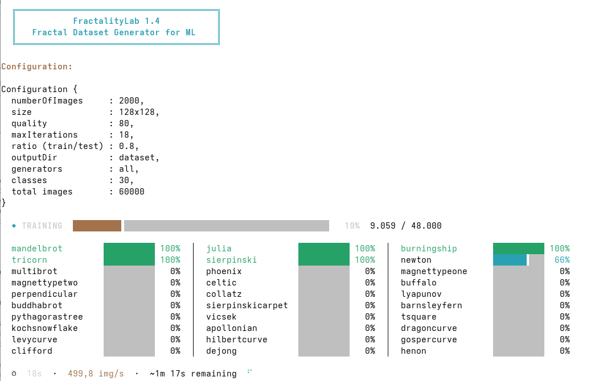
</div>

Want only specific fractals? Use `--generators`:
```bash
java -jar FractalityLab-1.4.jar --numberPerClass 200 --resolution 512 --generators mandelbrot,julia,burningship
```

See [CLI Reference](#cli-reference) for all options.

---

## Fractal Gallery

All 30 generators, one example each at 512x512 pixels.

### Escape-Time Fractals

<table>
<tr>
<td align="center">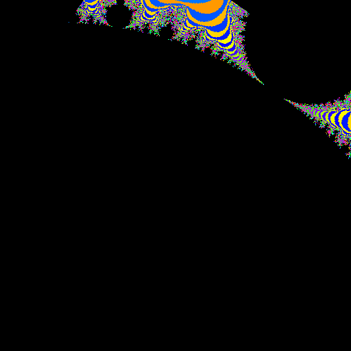<br/><b>Mandelbrot</b><br/><sub>z = z² + c</sub></td>
<td align="center">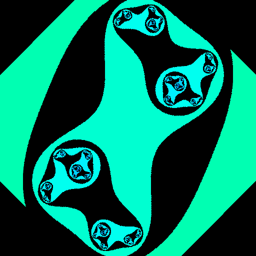<br/><b>Julia</b><br/><sub>Fixed complex c-parameter</sub></td>
<td align="center">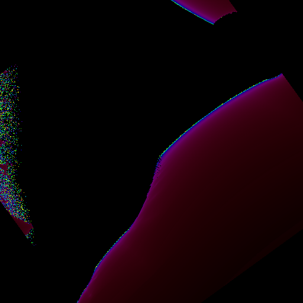<br/><b>Burning Ship</b><br/><sub>Absolute-value variant</sub></td>
<td align="center">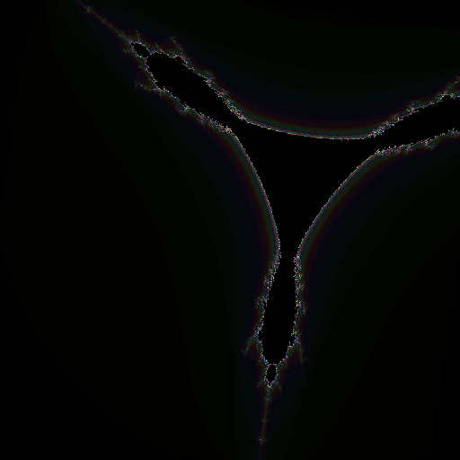<br/><b>Tricorn</b><br/><sub>Complex conjugate (Mandelbar)</sub></td>
</tr>
<tr>
<td align="center">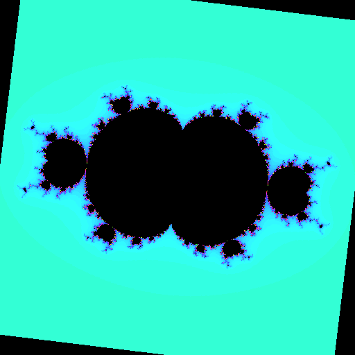<br/><b>Multibrot</b><br/><sub>z^d + c (d = 3–6)</sub></td>
<td align="center">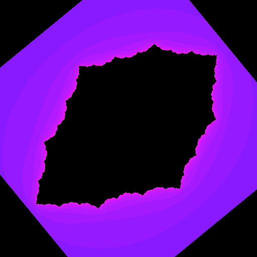<br/><b>Phoenix</b><br/><sub>Memory-based iteration</sub></td>
<td align="center">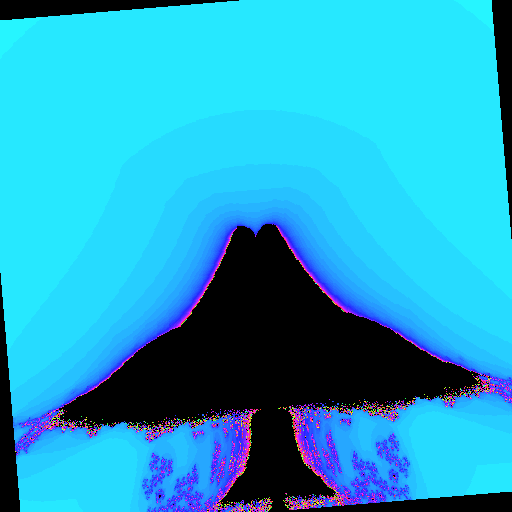<br/><b>Celtic</b><br/><sub>|Re(z²)| variant</sub></td>
<td align="center">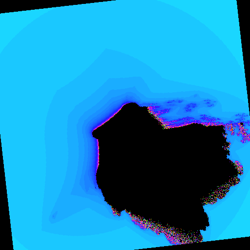<br/><b>Buffalo</b><br/><sub>Abs-variant with horns</sub></td>
</tr>
<tr>
<td align="center">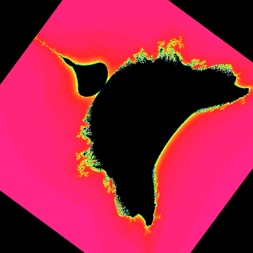<br/><b>Perpendicular</b><br/><sub>Cross-term variant</sub></td>
<td align="center">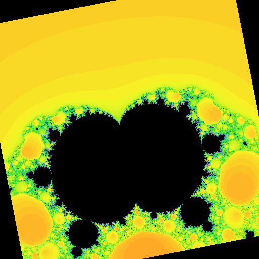<br/><b>Magnet Type I</b><br/><sub>Rational quadratic map</sub></td>
<td align="center">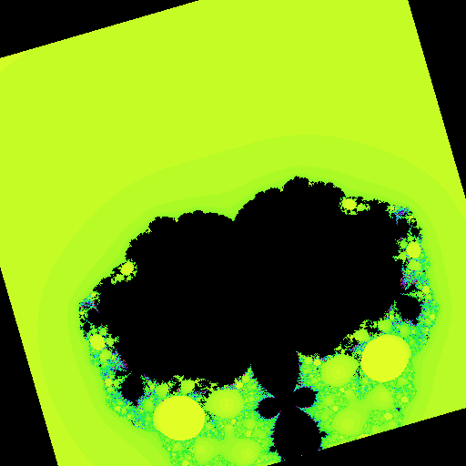<br/><b>Magnet Type II</b><br/><sub>Cubic numerator/denominator</sub></td>
<td align="center">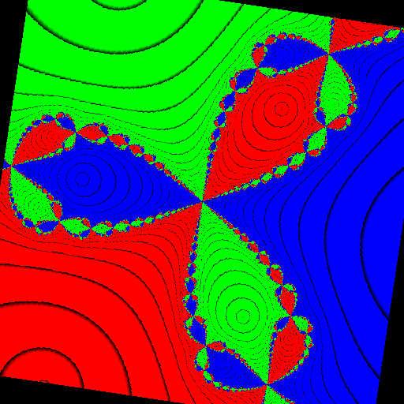<br/><b>Newton</b><br/><sub>Newton's method on z³ - 1</sub></td>
</tr>
<tr>
<td align="center">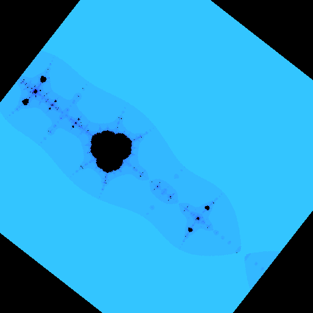<br/><b>Collatz</b><br/><sub>Complex Collatz conjecture</sub></td>
<td align="center">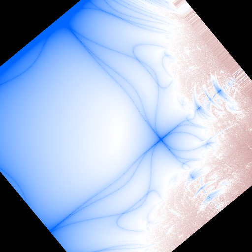<br/><b>Lyapunov</b><br/><sub>Logistic map exponent</sub></td>
<td align="center">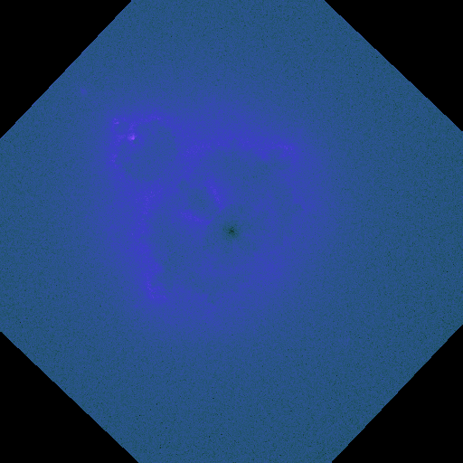<br/><b>Buddhabrot</b><br/><sub>Escaping trajectory density</sub></td>
<td></td>
</tr>
</table>

### Iterated Function Systems (IFS)

<table>
<tr>
<td align="center">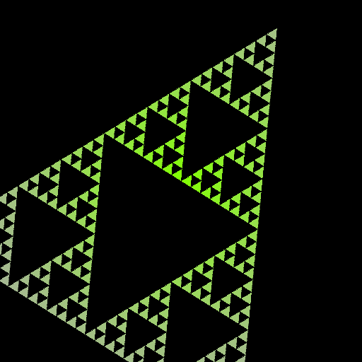<br/><b>Sierpinski Gasket</b><br/><sub>Triangular subdivision</sub></td>
<td align="center">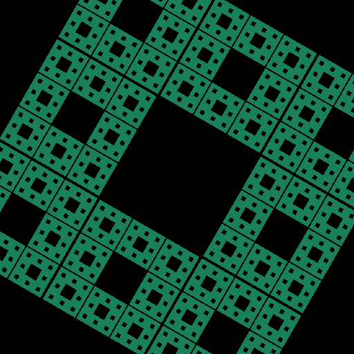<br/><b>Sierpinski Carpet</b><br/><sub>Square subdivision</sub></td>
<td align="center">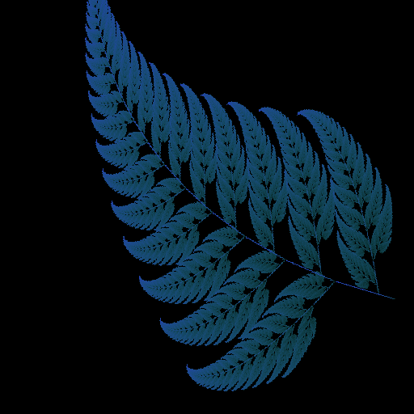<br/><b>Barnsley Fern</b><br/><sub>4 affine transforms</sub></td>
<td align="center">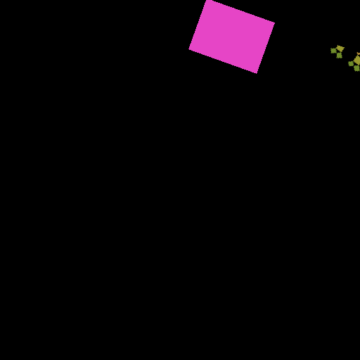<br/><b>Pythagoras Tree</b><br/><sub>Hypotenuse branching</sub></td>
</tr>
<tr>
<td align="center">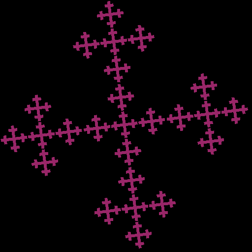<br/><b>Vicsek</b><br/><sub>Plus-shaped recursion</sub></td>
<td align="center">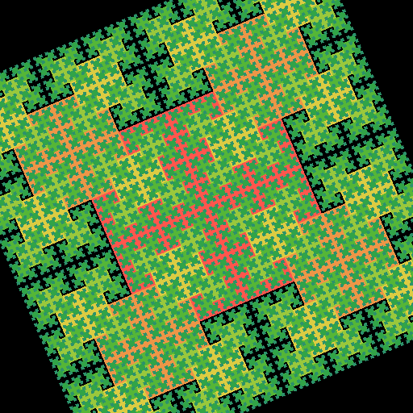<br/><b>T-Square</b><br/><sub>Overlapping corner squares</sub></td>
<td align="center">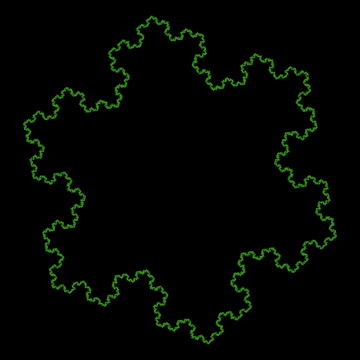<br/><b>Koch Snowflake</b><br/><sub>Recursive edge spikes</sub></td>
<td align="center">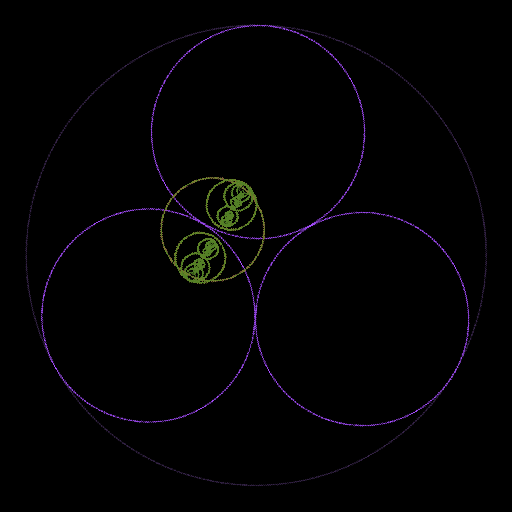<br/><b>Apollonian Gasket</b><br/><sub>Descartes circle packing</sub></td>
</tr>
</table>

### L-System Curves

<table>
<tr>
<td align="center">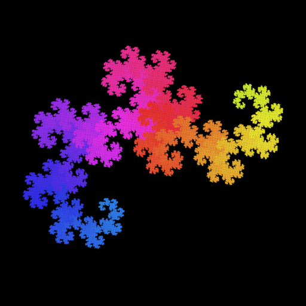<br/><b>Dragon Curve</b><br/><sub>90° turn space-filling</sub></td>
<td align="center">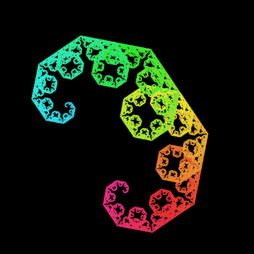<br/><b>Levy C Curve</b><br/><sub>45° self-similar</sub></td>
<td align="center">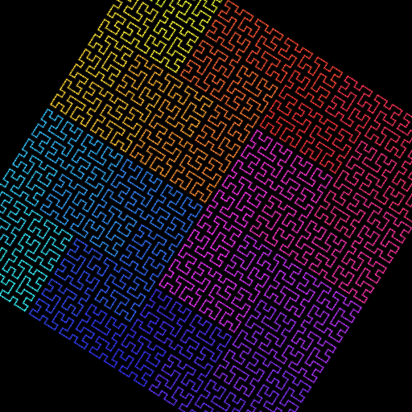<br/><b>Hilbert Curve</b><br/><sub>Grid space-filling</sub></td>
<td align="center">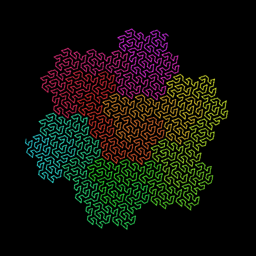<br/><b>Gosper Curve</b><br/><sub>Hexagonal flowsnake</sub></td>
</tr>
</table>

### Strange Attractors

<table>
<tr>
<td align="center">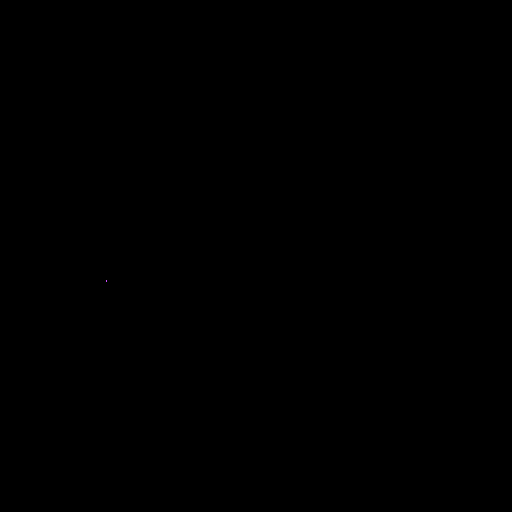<br/><b>Clifford</b><br/><sub>sin/cos 4-parameter</sub></td>
<td align="center">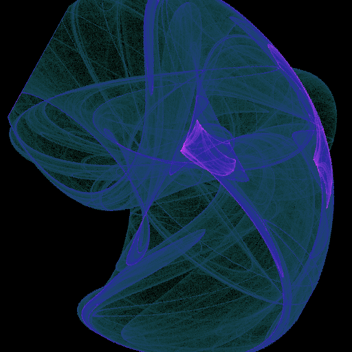<br/><b>De Jong</b><br/><sub>sin/cos attractor</sub></td>
<td align="center">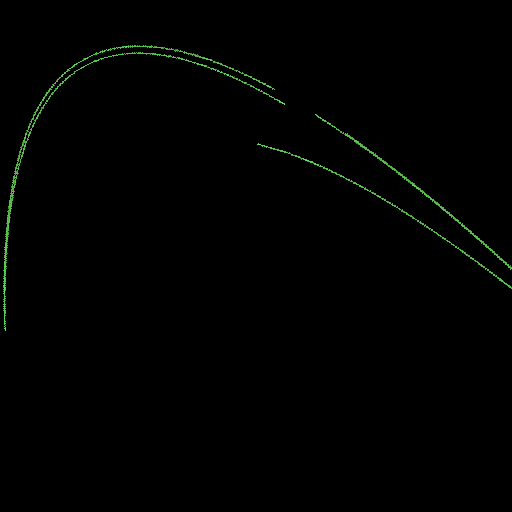<br/><b>Henon Map</b><br/><sub>1 - ax² + y, bx</sub></td>
<td></td>
</tr>
</table>

---

## Getting Started

### Prerequisites

- **JDK 25+** ([Eclipse Adoptium](https://adoptium.net/) or any OpenJDK distribution)

### Quick Start

```bash
# Clone
git clone https://github.com/Samyssmile/FractalityLab.git
cd FractalityLab

# Build
./gradlew build

# Generate 100 images per class at 256x256
./gradlew run --args="--numberPerClass 100 --resolution 256 --quality 80"
```

### Fat JAR

```bash
./gradlew jar
java -jar FractalityLab-1.4.jar \
  --numberPerClass 500 --resolution 512 --quality 90 --trainTestRatio 0.80
```

---

## CLI Reference

```
java -jar FractalityLab.jar [OPTIONS]
```

| Flag | Short | Description | Default |
|---|---|---|---|
| `--numberPerClass <n>` | `-n` | Images per fractal class | `100` |
| `--resolution <n>` | `-s` | Image resolution in pixels (width = height) | `256` |
| `--quality <0-100>` | `-q` | Image quality (`0` = heavily degraded, `100` = pristine) | `80` |
| `--maxIterations <n>` | `-i` | Base iteration depth for fractal algorithms | `18` |
| `--trainTestRatio <r>` | `-r` | Fraction of images in the training set (`0.0`–`1.0`) | `0.8` |
| `--output <dir>` | `-o` | Output directory | `dataset` |
| `--generators <list>` | `-g` | Comma-separated generator labels (see below) | all |
| `--help` | `-h` | Show help and exit | — |
| `--version` | | Show version and exit | — |

### Generator Labels

```
mandelbrot  julia        burningship    tricorn       sierpinski      newton
multibrot   phoenix      magnettypeone  magnettypetwo celtic          buffalo
perpendicular collatz    lyapunov       buddhabrot    sierpinskicarpet barnsleyfern
pythagorastree vicsek   tsquare        kochsnowflake apollonian      dragoncurve
levycurve   hilbertcurve gospercurve    clifford      dejong          henon
```

### Examples

```bash
# Generate only escape-time fractals
java -jar FractalityLab.jar --generators mandelbrot,julia,burningship --numberPerClass 200 --resolution 512

# High-resolution dataset with maximum quality
java -jar FractalityLab.jar --numberPerClass 50 --resolution 1024 --quality 100 --maxIterations 200

# Custom output directory with 90/10 train-test split
java -jar FractalityLab.jar --output my-dataset --trainTestRatio 0.90
```

---

## Output Structure

```
dataset/                        (or custom via --output)
├── train/
│   ├── mandelbrot/
│   │   ├── 0001.png
│   │   ├── 0002.png
│   │   └── ...
│   ├── julia/
│   ├── burningship/
│   ├── ... (one folder per generator)
│   └── images.csv              ← RFC 4180 metadata
└── test/
    ├── (same structure)
    └── images.csv
```

Each `images.csv` contains columns for file path and class label — ready for direct ingestion by PyTorch `ImageFolder`, TensorFlow `image_dataset_from_directory`, or any CSV-based data loader.

---

## Architecture

```
de.fractalitylab
├── cli/                    CLI parsing, ANSI colors
├── config/                 Immutable Configuration record
├── generators/             FractalGenerator interface + 30 implementations
│   ├── FractalRegistry     Central generator registry
│   ├── FractalMetadata     Generator metadata record
│   └── Complex             Complex number record
├── processing/             QualityProcessor (blur, noise, rotation)
├── data/                   ImageWriter, CSVWriter, DataElement
└── FractalOrchestrator     Virtual Thread orchestration + progress tracking
```

### Design Principles

- **Strategy Pattern** — each generator implements `FractalGenerator` with `generate()`, `label()`, and `metadata()`
- **Immutable Data** — Java records for `Configuration`, `FractalMetadata`, `Complex`, `DataElement`
- **Thread Safety** — `CopyOnWriteArrayList` for result collection, `ThreadLocalRandom` for randomness, no shared mutable state
- **Parallel Rendering** — `IntStream.parallel()` for pixel-level computation, Virtual Threads for image-level I/O

### Adding a New Generator

1. Create a class implementing `FractalGenerator` with `generate()`, `label()`, and `metadata()`
2. Add one line in `FractalRegistry.GENERATORS`
3. *(Optional)* Add a test — `FractalGeneratorContractTest` picks it up automatically

---

## Performance

| Layer | Strategy | Rationale |
|---|---|---|
| Pixel rendering | `IntStream.parallel()` (ForkJoinPool) | CPU-bound, benefits from work-stealing |
| Image orchestration | Virtual Threads | I/O-bound (file writes), lightweight concurrency |
| Quality processing | Batch pixel access | Minimizes `BufferedImage` lock overhead |
| Result collection | `CopyOnWriteArrayList` | Safe concurrent writes, read-once at end |

---

## Pre-Generated Datasets

| Dataset | Images | Resolution | Download |
|---|---|---|---|
| Small | 3,000 | 64 x 64 | [fractality-S.zip](https://hc-linux.eu/edux/fractality-S.zip) |
| Medium | 3,000 | 512 x 512 | [fractality-L.zip](https://hc-linux.eu/edux/fractality-L.zip) |
| Large | 30 | 4,000 x 4,000 | [fractality-XL.zip](https://hc-linux.eu/edux/fractality-XL.zip) |

---

## Related Projects

- [EDUX](https://github.com/Samyssmile/edux) — Java Machine Learning Library

---

## Contributing

Contributions are welcome. Fork the repository, create a feature branch, and submit a pull request.

```bash
./gradlew test   # Run tests before submitting
```

---

<div align="center">
<sub>Built with Java 25 and Virtual Threads</sub>
</div>
